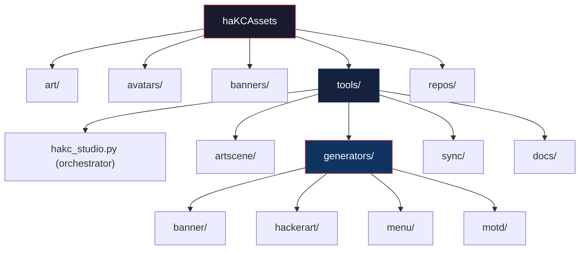
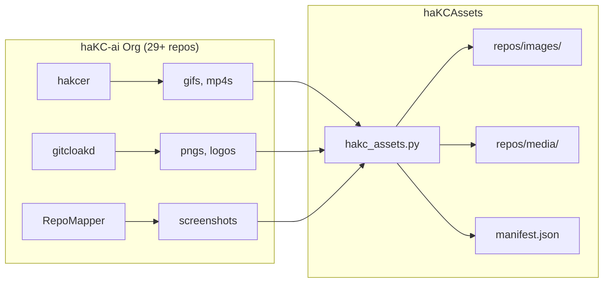

```
                ██████████                                      ·�·
                █▓       ░██                                           ✧
                █▒        ██ T H E   P I N A C L E  O F  H A K C I N G   Q U A L I T Y
    █████████████░        █████████████████ ████████████ ████████████      ████████████
   ██         ███░        ███▓▒▒▒▒▒▒▒▒▒▒▒██ █▒▒▒▒▒▒▒▒▓████        █████████▓          ▒█
   ██  ✧      ███         ███▒▒▒▒▒▒▒▒▒▒▒▒▓██████████████▓        ███▓▒      ▒▓░       ▒█
   ██         ███        ░██▓▒▒▒▒▒▒▒▒▒▒▒▒▒▓██▓▒▒▒▒▒▒▒▒█▓        ███░       ░██░       ▒█
   ██         ███        ▒██▓▒▒▒▒▒▒▒▒▒▒▒▒▒▒██▓▒▒▒▒▒▒▒▓▒        ██  ▓        ██░  ◆   ▓█
   ██         ██▓        ███▒▒▒▒▒▒▒▒▒▒▒▒▒▒▒▒█▓▒▒▒▒▒▒▒▓▒       ██   █        ██░       ▓
   ██         ██▒        ██▓▒▒▒▒▒▒▒▒▒▒▒▒▒▒▒▒▓▓▒▒▒▒▒▒▒▓▒      ██    █        ▓█████████
   ██     ★              ██▒▒▒▒▒▒▒▒█▓▒▒▒▒▒▒▒▒▒▒▒▒▒▒▒▒▓▒   ▒███████ █░       ░▓        █
   ██         ░░         ██▒▒▒▒▒▒▒▒██▒▒▒▒▒▒▒▒▒▒▒▒▒▒▒▒▓█ ▓        ░█ ▓       ░▒       ░█
   ██         ██░       ░█▒▒▒▒▒▒▒▒▒▒▒▒▒▒▒▒▒▒▒▒▒▒▒▒▒▒▒▓█ █░        ▒ █                ░█
   ██   ·     ██        ▓█▒▒▒▒▒▒▒▒▒██▓▒▒▒▒▒▒▒▒▒▒▒▒▒▒▒▓█ █░        ▒ █░               ▒█
    ██████████  ███████████▓██▓▓█▓█  █▓▒▒▒▒▒▒▒▒▒▓██▓██   █▓▓▓▓▓▓▓█    █▓▓▓▓▓▓/\▓▓▓▓▓▓██ 
  .:/____________________ █▓██▓██ ________ ████▓█▓████ _ ________________.  /  \.______\:.
     _ __ _______________  ██▓██ __________ █▓▓▓██ ██ __________________. \/ /\.____ ___
                             █▓█             ██▓██                       \  /
                              ██               ███                        \/
```

<p align="center">

[](https://github.com/haKC-ai)
[](LICENSE)
[](https://python.org)
[](.)
[](banners/)

</p>

<p align="center">
<strong>Central asset repository for the haKC.ai organization</strong><br>
Artwork, ASCII/ANSI banners, generators, and tools
</p>

---

## Features

```
▸ Asset Management      Organize & sync assets from 29+ org repos
▸ Banner Generator      Create ASCII banners with template variables
▸ MOTD System           101+ messages in classic BBS/warez style
▸ Hacker Art Generator  NFO-style art from artscene archives
▸ Menu Generator        BBS-style menu templates (warez/minimal/modern)
▸ Studio Orchestrator   Menu-driven access to all generators with hakcer effects
```

---

## Repository Structure



```
haKCAssets/
├── art/                        # Logos, graphics, promotional images
│   ├── haKCAI.png              # Main logo (1732x1732)
│   ├── hakc_button.png         # Web button/badge
│   └── promo_header.png        # Social media header
├── avatars/                    # Profile pictures & gravatars
├── banners/                    # ASCII/ANSI art collection
│   ├── banner_full.txt         # Complete haKC banner
│   └── banner_component*.txt   # Modular banner pieces
├── repos/                      # Synced assets from org repos (by type)
│   ├── images/{repo}/
│   ├── media/{repo}/
│   └── manifest.json
├── tools/
│   ├── hakc_studio.py          # Main orchestrator (menu-driven)
│   ├── artscene/               # NFO indexer & artscene archive
│   │   ├── motd.py             # MOTD generator from artscene
│   │   └── index.db            # SQLite index of NFO files
│   ├── generators/
│   │   ├── banner/             # Banner generator with {motd} variables
│   │   │   ├── hakc_banner.py
│   │   │   └── banner_withvariables.txt
│   │   ├── hackerart/          # NFO-style art generator
│   │   │   ├── hakc_art.py
│   │   │   └── nfo_effects.py
│   │   ├── menu/               # BBS menu templates
│   │   │   └── hakc_menu.py
│   │   ├── motd/               # MOTD messages & manager
│   │   │   ├── hakc_motd.py
│   │   │   └── motd.json       # 101+ messages
│   │   └── lib.py              # Shared utilities
│   └── sync/                   # Asset sync tools
│       ├── hakc_assets.py      # Unified asset manager
│       ├── organize.py         # Auto-organize by rules
│       └── sync_org.py         # Sync from GitHub org
├── branding.json               # Branding guidelines & style spec
└── asset_rules.json            # Auto-organization rules
```

---

## Quick Start

### haKC Studio (Main Menu)

```bash
# Launch the orchestrator with animated banner
python tools/hakc_studio.py

# Set theme
python tools/hakc_studio.py --theme synthwave
```

```
╔════════════════════════════════════════════════════════════╗
║═══════════════════ haKC STUDIO MENU ═══════════════════════║
╠════════════════════════════════════════════════════════════╣
║                                                            ║
║  [1] Banner Generator     Create ASCII banners             ║
║  [2] Hacker Art Generator NFO-style art creation           ║
║  [3] Menu Generator       BBS menu templates               ║
║  [4] MOTD Manager         View/add messages                ║
║  [5] NFO Effects          Animated NFO banner              ║
║  [6] Settings             Theme & preferences              ║
║                                                            ║
║  [Q] Quit                                                  ║
╚════════════════════════════════════════════════════════════╝
```

### Asset Management

```bash
# Check status
python tools/sync/hakc_assets.py status

# Organize files (dry run)
python tools/sync/hakc_assets.py organize

# Sync from all org repos
python tools/sync/hakc_assets.py sync --apply

# Watch mode - auto-organize continuously
python tools/sync/hakc_assets.py watch --interval 30
```

---

## Generators

### Banner Generator

Generate ASCII banners with template variables from `motd.json`:

```bash
# Generate from style
python tools/generators/banner/hakc_banner.py --name "MyProject" --style warez

# Use template with random variables
python tools/generators/banner/hakc_banner.py --template banner_withvariables.txt

# Generate 5 variants with different random messages
python tools/generators/banner/hakc_banner.py --template banner_withvariables.txt --count 5

# Save to file
python tools/generators/banner/hakc_banner.py --template banner_withvariables.txt --output banner.txt

# Override specific variables
python tools/generators/banner/hakc_banner.py --template banner_withvariables.txt --motd "Custom message"
```

**Template Variables:**
| Variable | Source | Description |
|----------|--------|-------------|
| `{motd}` | `motd.json` | Random message of the day |
| `{greets}` | `motd.json` | Random greets line |
| `{fus}` | `motd.json` | Random FU line |
| `{signatures}` | `motd.json` | Random signature |

**Styles:** `warez` | `minimal` | `cyberpunk` | `retro` | `modern`

### Hacker Art Generator

Generate NFO-style ASCII art from artscene archives:

```bash
# Generate art for project
python tools/generators/hackerart/hakc_art.py "MyProject"

# Specific style
python tools/generators/hackerart/hakc_art.py "MyProject" --style warez

# Random NFO from collection
python tools/generators/hackerart/hakc_art.py --random

# Animated NFO banner (sparkle effect)
python tools/generators/hackerart/hakc_art.py --nfo --animate

# Typing effect
python tools/generators/hackerart/hakc_art.py --nfo --typing

# Interactive mode
python tools/generators/hackerart/hakc_art.py --interactive
```

### Menu Generator

Generate BBS-style menu templates:

```bash
# Warez style (default)
python tools/generators/menu/hakc_menu.py --name "Settings" --options "Audio,Video,Network,About"

# BBS style
python tools/generators/menu/hakc_menu.py --name "Main" --style bbs

# Modern style
python tools/generators/menu/hakc_menu.py --name "Config" --style modern

# Interactive mode
python tools/generators/menu/hakc_menu.py --interactive
```

**Styles:** `warez` | `minimal` | `bbs` | `modern`

### MOTD Manager

101+ messages in classic BBS/warez style:

```bash
# Get random MOTD
python tools/generators/motd/hakc_motd.py

# List all categories
python tools/generators/motd/hakc_motd.py --list

# Get from specific category
python tools/generators/motd/hakc_motd.py --category greets

# Add new message
python tools/generators/motd/hakc_motd.py --add "Your new message here"
```

---

## Asset Sync Flow



Assets organized **type-first** for easy discovery:

| Type | Path | Extensions |
|------|------|------------|
| Images | `repos/images/{repo}/` | PNG, JPG, GIF, SVG, WebP |
| Media | `repos/media/{repo}/` | MP4, MOV, WebM |
| Banners | `repos/banners/{repo}/` | TXT (ASCII/ANSI) |
| Icons | `repos/icons/{repo}/` | ICO, PNG |
| Slidedecks | `repos/slidedecks/{repo}/` | PDF |

---

## Branding Guidelines

See [`branding.json`](branding.json) for the full style specification.

### Colors (synthwave palette)

| Name | Hex | shields.io | Usage |
|------|-----|------------|-------|
| Primary | `#00D9FF` | `00D9FF` | Cyan - main accent |
| Secondary | `#FF10F0` | `FF10F0` | Hot pink - highlights |
| Accent | `#7928CA` | `7928CA` | Purple - secondary accent |
| Success | `#00FF41` | `00FF41` | Matrix green - success states |
| Warning | `#FFB000` | `FFB000` | Amber - warnings |
| Error | `#FF006E` | `FF006E` | Hot pink - errors |

### Badge Templates

```markdown


```

### Voice & Tone

- **Embrace:** BBS/warez nostalgia, terminal culture, hacker humor, self-deprecation
- **Avoid:** Corporate speak, buzzwords, excessive emojis

---

## Raw URLs for Embedding

```markdown
# Logo


# Button


# Banner (text)
https://raw.githubusercontent.com/haKC-ai/haKCAssets/main/banners/banner_full.txt
```

---

## Contributing

1. Drop files in repo root
2. Run `python tools/sync/hakc_assets.py organize --apply`
3. Files auto-route based on [`asset_rules.json`](asset_rules.json)

**Naming convention:** `lowercase_with_underscores`

---

<p align="center">

```
   `bg,.*~'`^`'~*-,._.,-*~'`^`'~*-,._.,-*~'`^`'~*-,._.,-*~'`^`'~*-,._.,-*~'`^`'~*.,gb`
                           ───── ▓ signed, /dev/haKCØRY.23: ▓ ─────
                                 "nano > vim. come fight us."
```

**GR33TZ:** SecKC, LEGACY CoWTownComputerCongress, ACiD, iCE, T$A, badge lords, modem jammers

</p>
